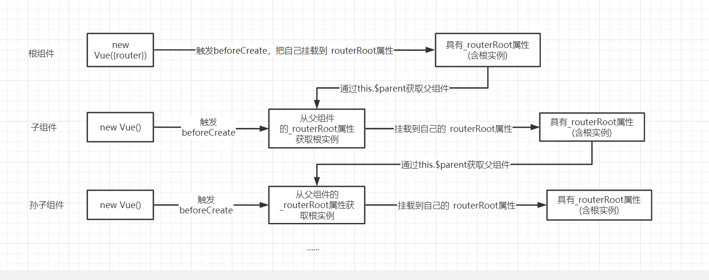

## install()的实现

都知道，当使用`Vue.use()`安装插件时，会自动执行插件对象中的`install()`方法。所以先来阅读一下`install()`方法的源码，了解一下安装`VueRouter`的过程。该方法的实现在源码的`src/install.js`中。

### 确保只执行一次的方法
在`install()`方法的第一行，看到了如下代码：
```JavaScript
if (install.installed && _Vue === Vue) return
install.installed = true
```
这段代码主要是为了保证`install()`方法不被重复执行，因为这个方法只需要执行一次就够了。当执行`install()`方法时，就会给这个方法添加一个`installed `属性，表示该方法已经执行，判断到`installed`属性为`true`时，停止执行下面的内容。


### 使用内部变量接收Vue实例
`install()`方法会默认传入一个`Vue`的实例，在源码中看到，它使用了一个私有变量(前面有下滑线表示该变量是私有的，写法要求)来存放这个`Vue`实例，目的是为了让这个实例能给内部的其他地方所使用，并且这还可以节省打包的体积，因为如果直接去`import Vue`的话，`webpack`会把`import`的内容打包进来的，这样会增加打包的体积。源码如下：

```JavaScript
export let _Vue;
export function install (Vue) {
	_Vue = Vue
}
```

### 使用Vue.mixin给混入钩子函数
`Vue`中`mixin()`是将一段可以复用的组件`options`混入到组件中，和组件中同名的`options`进行合并。在源码中它使用是全局的`mixin()`，是给整个项目的所有`Vue`组件都混入一段`options`，一起来看看它这段`options`到底做了什么，贴下源码：

```JavaScript
Vue.mixin({
    beforeCreate () {
      if (isDef(this.$options.router)) {
        this._routerRoot = this
        this._router = this.$options.router
        this._router.init(this)
        Vue.util.defineReactive(this, '_route', this._router.history.current)
      } else {
        this._routerRoot = (this.$parent && this.$parent._routerRoot) || this
      }
      registerInstance(this, this)
    },
    destroyed () {
      registerInstance(this)
    }
  })
```
可以看到`Vue.mixin()`方法向所有的组件混入了两个钩子函数，一个是刚开始创建组件的生命钩子`beforeCreate()`，一个是`Vue`组件销毁后的生命钩子`destroyed()`，这里讲一下在这两个生命钩子中都做了什么事情：

首先在`beforeCreate()`中，它做了以下几件事情：
1. 给所有`Vue`组件挂载上`_routerRoot属性`，该属性指向根组件
2. 给根组件挂载上`VueRouter`实例
3. 初始化路由
4. 使用`Vue.util.defineReactive`，将`_ route`变成一个响应式数据并且挂载到根组件上
5. 注册`Vue`实例（和`router-view`组件的`render`函数有关，后面说）

而在`destroyed()`中，它做了一件事情，就是销毁实例。

接下来对其中一些操作的源码进行解读。

#### 实现所有组件挂载\_routeRoot
这里实现的核心就是`$parent`属性，`$parent`能够获取当前Vue组件的父组件。

那么只要父组件能够获取根组件的话，那么当前的`Vue`组件也就可以从父组件获取根组件了。`Vue`组件的创建顺序是从根组件开始，逐层创建。所以只要让根组件能够存在一个属性指向它本身，也就能够通过这个创建的顺序，让所有组件最终都能获取根组件。

接下来对源码的实现进行解读，当创建根组件的时候，添加`_routeRoot`属性，指向自身；

接下来创建根组件的子组件时，子组件通过`this.$parent.\_routerRoot`属性从父类获取到根组件，自身添加`_routeRoot`属性，指向这个根组件；

然后是创建孙子组件，此时子组件已经具有`_routeRoot`属性指向根组件，所以孙子组件又能通过`this.$parent`获取子组件，从子组件上的`_routeRoot`属性获取根组件，然后让自身的`_routeRoot`属性指向根组件。每个组件的创建的时候都会执行这样的逻辑，最后所有的组件都会具有`_routeRoot`属性，指向的就是根组件。下面用一张图来表示这个过程：



#### 如何获取VueRouter实例
通过源码可以知道，在根组件创建的时候，把`VueRouter`的实例挂载到了它身上。那么这个`VueRouter`是从哪里来的呢？在`Vue`项目中的`mian.js`会有以下代码：
```JavaScript
import Router from 'vue-router'

Vue.use(Router)

const router = new Router({
   ...
})

new Vue({
    router,
    render: h => h(App)
}).$mount('#app')
```
在创建根组件的时候，把`router`实例做为参数传入，这样子就可以通过`this.$options`属性获取到这个`router`并且挂载，而且也能通过判断`$options`属性中是否存在`router`实例来判断当前组件是否为根组件，以下是获取`router`实例的全过程：
1. 在`mian.js`中，通过`import`导入`VueRouter`的构造函数。
2. `Vue.use()`安装插件，混入生命钩子函数`beforeCreate和destroyed`。
3. 执行构造函数，创建`VueRouter`实例。
4. 创建根组件，将`VueRouter`实例作为参数传入，根组件创建时触发`beforeCreate`钩子，通过`$options`获取到并挂载上去。

#### 其他操作
先来看这两行代码：
```JavaScript
	this._router.init(this)
	Vue.util.defineReactive(this, '_route', this._router.history.current)
```
这里使用了`VueRouter`实例的`init()`方法，进行路由的初始化，比如添加监听器等。这个方法的实现在`index.js`中，后面解读这个文件的源码时在细说其具体的实现。

下面代码使用了`defineReactive()`方法，这个方法主要是将一个数据变成一个响应式数据。在这里它将`_route`属性转变成了响应式属性，这个属性主要是存放着当前路由的一些信息，比如渲染的组件。当`_route`属性发生变化时，就会去获取当前路由所对应的组件并渲染。

### $route和$router属性的挂载
经常都会使用`$router`属性去跳转、用`$route`获取路由传递的参数等。这两个属性是怎么来的呢。在`install()`方法中有如下的代码：
```JavaScript
Object.defineProperty(Vue.prototype, '$router', {
    get () { return this._routerRoot._router }
  })
Object.defineProperty(Vue.prototype, '$route', {
	get () { return this._routerRoot._route }
})
```
这里通过`Object.defineProperty`将这两个属性挂载到了Vue的原型上，也就是全局挂载。可以看到，当访问`$router`和`$route`属性时，访问的是当前组件的`_routeRoot`属性，这个属性指向的是根实例。因为上面说了`_router`和`_route`属性是挂载在根组件上的。这么写还有一个好处，就是防止开发者对这两个属性进行篡改，导致未知的错误。


### 全局注册router-view、router-link
最后就是通过全局注册组件的方式，生成`router-view`和`router-link`两个路由组件。
```JavaScript
Vue.component('RouterView', View)
Vue.component('RouterLink', Link)
```

### 小结
- 当使用`Vue.use()`下载插件对象时，会给插件对象的`install()`方法默认传递一个`Vue`实例作为参数。使用变量保存`Vue`实例，方便内部其他地方的使用，解决了显示的引入`Vue`带来的打包问题。
- 使用全局`Vue.mixin()`向所有组件混入`beforeCreate`和`destroyed`钩子，进行路由的一系列初始化、以及将根组件挂载到所有组件上。
- 利用了组件的渲染顺序，在渲染根组件的时候，添加`_routeRoot`属性，指向根组件本身，当渲染子组件的时候就可以通过`this.$parent`属性获取到已经添加`_routeRoot`属性的父组件，从而获取到根组件添加在自己的`_routeRoot`属性身上，这样就可以让所有组件都会添加上`_routeRoot`属性指向根实例。
- 通过`Object.defineProperty`将`$router`、`$route`全局挂载，所有的组件都可以获取到这两个属性。访问的是挂载在根实例上的`_router`和`_route`属性。同时这种写法还防止开发者对这两个属性进行篡改，导致未知的错误。
- 生成全局组件`router-view`和`router-link`，这两个是路由的核心组件。

