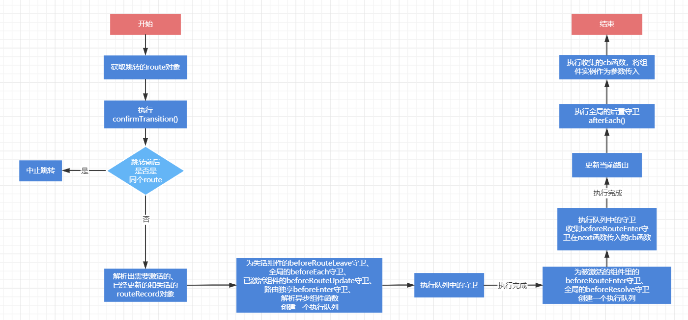

## History类的实现

在日常使用中，我们都知道`Vue-router`支持2种模式，一种是`hash模式`，另一种是`history模式`。
在前面的章节说过，对于`hash`模式和`history`模式，分别采用了`HashHistory类`和`HTML5History类`来实现，源码位置位于`history.js`中。

### 非浏览器环境下的vue-router

`history`文件夹中有四个文件夹，分别是`hash.js`、`html5.js`、`base.js`、`abstract.js`。前面两个分别就是`HashHistory`类和`HTML5History`类的实现了，那后面两个到底是什么呢？

在日常的开发中，`vue-router`的环境都是以浏览器环境作为前提的，那么如果开发者想要在非浏览器环境使用`vue-router`可以吗？答案是可以的，因为`vue-router`在非浏览器环境中又实现了一个`AbstractHistory类`，专门用于非浏览器环境，`abstract.js`就是对`AbstractHistory`类的实现。
#### AbstractHistory类实现
其实`AbstractHistory`类并不是本次解析的重点，所以这里就粗略的说一下，`abstract`模式的实现原理：

在浏览器中，使用了一个历史堆栈用来维护访问过的历史记录，前进、替换、后退等各种功能都是通过操作历史堆栈来实现的。而`abstract`模式同样借鉴了这个特点，`AbstractHistory`类内部维护了一个堆栈，对历史记录进行管理。

下面是构造函数的代码：

```JavaScript
export class AbstractHistory extends History {
  index: number
  stack: Array<Route>

  constructor (router: Router, base: ?string) {
    super(router, base)
    this.stack = []
    this.index = -1
  }
}
```
可以看到`AbstractHistory类`内部维护着一个历史堆栈`stack`，前进、后退、替换等功能通过操作堆栈来实现，这也就是为什么`vue-router`在非浏览器环境下也能使用的原因所在。

### History类

无论是`hash`模式、`history`模式、还是`abstract`模式，在实现路由的前进、替换、后退等各种功能时。有一些操作是必须的，比如，**匹配相应的路由**、**更新路由**、**执行钩子函数等**。

在源码中，这些行为被抽离出来，以类的形式进行了封装，也就是这章的主角——`History`类。这是三大模式的基类，无论是`HashHistory`类、`HTML5History`类，还是`AbstractHistory`类，都是继承自`History`类。接下来开始对其实现进行解读。源码位置在`base.js`中。


#### 构造函数
先来看看其属性及构造函数、了解其结构，贴上源码：
```JavaScript
export class History {
  router: Router
  base: string
  current: Route
  pending: ?Route
  cb: (r: Route) => void
  ready: boolean
  readyCbs: Array<Function>
  readyErrorCbs: Array<Function>
  errorCbs: Array<Function>
  listeners: Array<Function>
  cleanupListeners: Function // 清除定时器的方法

  // implemented by sub-classes
  +go: (n: number) => void
  +push: (loc: RawLocation, onComplete?: Function, onAbort?: Function) => void
  +replace: (
    loc: RawLocation,
    onComplete?: Function,
    onAbort?: Function
  ) => void
  +ensureURL: (push?: boolean) => void
  +getCurrentLocation: () => string
  +setupListeners: Function

  constructor (router: Router, base: ?string) {
    this.router = router // router实例
    this.base = normalizeBase(base) // 基路径
    this.current = START // 当前路径
    this.pending = null
    this.ready = false
    this.readyCbs = [] // 初始化成功回调
    this.readyErrorCbs = [] // 初始化失败回调
    this.errorCbs = [] // 存放错误回调函数
    this.listeners = [] // 监听器数组
  }
```
在上面的代码中给属性加上了注释，方便大家理解每个属性的含义。

#### transitionTo()

刚刚上面说到了，不论是那种模式进行路由切换，像匹配相应的路由、更新路由、执行钩子函数等操作，都是必须要进行的，这些操作的实现都在`transitionTo()`方法中，`transitionTo()`是整个`vue-router`中非常重要的方法之一。下面一起来了解它的实现，首先了解函数的结构：
```JavaScript
transitionTo (
    location: RawLocation,
    onComplete?: Function,
    onAbort?: Function
  ) { ... }
```
`transitionTo()`方法支持三个参数，`location`、`onComplete`、`onAbort`。`location`之前在讲解`Matcher`时讲过，`onComplete`是跳转成功执行的回调函数，而`onAbort`是跳转失败执行的回调函数。

接下来开始对其跳转过程进行解析，献上源码：
```JavaScript
  {
	let route
    try {
      route = this.router.match(location, this.current)
    } catch (e) {
      this.errorCbs.forEach(cb => {
        cb(e)
      })
      // Exception should still be thrown
      throw e
    }
    const prev = this.current
    this.confirmTransition(
      route,
      () => {
        this.updateRoute(route)
        onComplete && onComplete(route)
        this.ensureURL()
        this.router.afterHooks.forEach(hook => {
          hook && hook(route, prev)
        })

        // fire ready cbs once
        if (!this.ready) {
          this.ready = true
          this.readyCbs.forEach(cb => {
            cb(route)
          })
        }
      },
      err => {
        if (onAbort) {
          onAbort(err)
        }
        if (err && !this.ready) {
          if (!isNavigationFailure(err, NavigationFailureType.redirected) || prev !== START) {
            this.ready = true
            this.readyErrorCbs.forEach(cb => {
              cb(err)
            })
          }
        }
      }
    )
  }
```

首先利用`router`实例的`match`方法，利用匹配器获取相对应的`route`对象，紧接着定义了`pre`变量，用来保存跳转之前的`route`对象，最后调用了`confirmTransition()`方法进行跳转。

#### confirmTransition()
先来了解方法的结构：
```JavaScript
confirmTransition (route: Route, onComplete: Function, onAbort?: Function) {}
```
`confirmTransition()`方法支持传入三个参数，分别是`route`对象、成功回调函数`onComplete`、失败回调函数`onAbort`。

这个方法的内部实现比较复杂，我在这里将会分段进行讲解，首先贴上第一部分源码：
```JavaScript
	const current = this.current
    this.pending = route
    const abort = err => {
      if (!isNavigationFailure(err) && isError(err)) {
        if (this.errorCbs.length) {
          this.errorCbs.forEach(cb => {
            cb(err)
          })
        } else {
          warn(false, 'uncaught error during route navigation:')
          console.error(err)
        }
      }
      onAbort && onAbort(err)
    }
    const lastRouteIndex = route.matched.length - 1
    const lastCurrentIndex = current.matched.length - 1
    if (
      isSameRoute(route, current) &&
      lastRouteIndex === lastCurrentIndex &&
      route.matched[lastRouteIndex] === current.matched[lastCurrentIndex]
    ) {
      this.ensureURL()
      return abort(createNavigationDuplicatedError(current, route))
    }
```

在这部分代码中，首先是定义了一个跳转失败的处理函数。并且对当前的`route`对象和即将要跳转的`route`对象进行了一个对比，如果跳转前后是同一个`route`，那么就直接中止跳转，并且执行相应的错误处理函数。

##### 路由守卫的实现
对于使用`vue-router`的开发者来说，肯定是不陌生了，路由守卫能在我们切换路由前后进行各种各样的自定义操作。它的实现就存在于这个方法中，我会对其进行详细的解析，争取让读者能够理解整个路由守卫的实现过程。

先看官网给的导航解析过程：
1. 导航被触发。
2. 在失活的组件里调用 `beforeRouteLeave` 守卫。
3. 调用全局的 `beforeEach `守卫。
4. 在重用的组件里调用 `beforeRouteUpdate` 守卫 (2.2+)。
5. 在路由配置里调用 `beforeEnter`。
6. 解析异步路由组件。
7. 在被激活的组件里调用` beforeRouteEnter`。
8. 调用全局的 `beforeResolve `守卫 (2.5+)。
9. 导航被确认。
10. 调用全局的 `afterEach `钩子。
11. 触发 DOM 更新。
12. 调用` beforeRouteEnter `守卫中传给 `next` 的回调函数，创建好的组件实例会作为回调函数的参数传入。

接下来开始一步步解析其实现过程：

###### 1. 解析跳转前后路由，划分路由种类

```JavaScript
const { updated, deactivated, activated } = resolveQueue(
   this.current.matched,
   route.matched
)
```
还记得这个`matched`属性吗？前面介绍过，这个属性是一个数组，存放着当前的`route`和其所有上级`route`的`record`对象。`resolveQueue`函数会根据传入的两个不同的`route`的`matched`属性，解析出三个队列，分别是：
- updated：表示激活过的路由
- deactivated：表示失活的路由
- activated：表示需要激活的路由

稍微了解一下`resolveQueue`函数是怎么实现的，该源码位置位于`util/route.js`中
```JavaScript
function resolveQueue (
  current: Array<RouteRecord>,
  next: Array<RouteRecord>
): {
  updated: Array<RouteRecord>,
  activated: Array<RouteRecord>,
  deactivated: Array<RouteRecord>
} {
  let i
  const max = Math.max(current.length, next.length)
  for (i = 0; i < max; i++) {
    if (current[i] !== next[i]) {
      break
    }
  }
  return {
    updated: next.slice(0, i),
    activated: next.slice(i),
    deactivated: current.slice(i)
  }
}
```
实现思路大概如下：

- 把当前的`matched`列表`current`和要跳转的`matched`列表`next`作对比，只要有一个不相等就终止匹配。
- 两者相等的部分归类为`updated`，表示已经更新的路由，无需再次激活
- `next`中和`current`不相等的部分，归类到`activated`，表示需要激活的路由
- 而`current`中和`next`不相等的部分，归类到`deactivated`，表示失活的路由

###### 2. 创建执行的函数队列

首先是定义了一个队列，用来存放执行的钩子函数
```JavaScript
const queue: Array<?NavigationGuard> = [].concat(
      // in-component leave guards
      extractLeaveGuards(deactivated),
      // global before hooks
      this.router.beforeHooks,
      // in-component update hooks
      extractUpdateHooks(updated),
      // in-config enter guards
      activated.map(m => m.beforeEnter),
      // async components
      resolveAsyncComponents(activated)
    )
```
这个队列依次存放了以下导航守卫
1. 失活组件中的`beforeRouteLeave`守卫
2. `router`实例上的`beforeHooks`属性，其实就是全局`beforeEach`守卫
3. 已经激活过的组件中的`beforeRouteUpdate` 守卫 
4. 路由内部的`beforeEnter`守卫
5. 解析异步组件的函数

这里介绍一下如何提取失活组件和需激活组件中的导航守卫，来看看`extractLeaveGuards()`和`extractUpdateHooks()`函数的源码：
```JavaScript
function extractLeaveGuards (deactivated: Array<RouteRecord>): Array<?Function> {
  return extractGuards(deactivated, 'beforeRouteLeave', bindGuard, true)
}

function extractUpdateHooks (updated: Array<RouteRecord>): Array<?Function> {
  return extractGuards(updated, 'beforeRouteUpdate', bindGuard)
}
```
它内部其实都调用了同一个函数`extractGuards()`，接着贴上该函数的源码：
```JavaScript
function extractGuards (
  records: Array<RouteRecord>,
  name: string,
  bind: Function,
  reverse?: boolean
): Array<?Function> {
  const guards = flatMapComponents(records, (def, instance, match, key) => {
    const guard = extractGuard(def, name)
    if (guard) {
      return Array.isArray(guard)
        ? guard.map(guard => bind(guard, instance, match, key))
        : bind(guard, instance, match, key)
    }
  })
  return flatten(reverse ? guards.reverse() : guards)
}
```
`extractGuards()`接收四个参数分别是`record`对象数组、需要获取的属性`name`、绑定函数`bind`，是否反转的标识符`reverse`。

这个函数又运用到了`flatten`函数、`flatMapComponents`函数和`extractGuard`函数，源码如下：
```JavaScript
function extractGuard (
  def: Object | Function,
  key: string
): NavigationGuard | Array<NavigationGuard> {
  if (typeof def !== 'function') {
    // extend now so that global mixins are applied.
    def = _Vue.extend(def)
  }
  return def.options[key]
}

export function flatMapComponents (
  matched: Array<RouteRecord>,
  fn: Function
): Array<?Function> {
  return flatten(matched.map(m => {
    return Object.keys(m.components).map(key => fn(
      m.components[key],
      m.instances[key],
      m, key
    ))
  }))
}

export function flatten (arr: Array<any>): Array<any> {
  return Array.prototype.concat.apply([], arr)
}

```
先介绍下这几个函数的含义：

`flatten()函数`只是一个函数扁平化的作用，将二维数组转成一位数组。

`flatMapComponents()函数`是用来处理record数组的。它支持两个参数，一个是record数组，另一个是自定义执行方法fn。通过遍历record数组中的每个record对象，拿到存放vue组件的对象components，然后再遍历components中所有Key，执行fn函数。

`extractGuard()函数`接收两个参数，一个是组件，另一个是指定的key，这个函数最终会返回组件中指定key的数据。

了解这三个函数的作用之后，就可以来讲`extractGuards()`函数的实现了，首先是使用了`flatMapComponents`函数遍历了`record`数组，获取到其存放组件的`components`对象，执行了以下自定义函数：
- 利用`extractGuard()`函数，获取组件内部的守卫函数。
- 使用`bindGuard()`函数，将钩子函数和当前组件实例绑定起来。

这样就能得到一个包含所有组件的守卫钩子的队列。

最后得到钩子函数队列再使用`flatten()`函数进行扁平化处理，就是最终的结果了。

以上就是获取组件内部守卫钩子函数的实现。

###### 3. 路由守卫的执行
接下来是定义了一个用来执行路由守卫的执行器，贴上代码：
```JavaScript
const iterator = (hook: NavigationGuard, next) => {
      if (this.pending !== route) {
        return abort(createNavigationCancelledError(current, route))
      }
      try {
        hook(route, current, (to: any) => {
          if (to === false) {
            // next(false) -> abort navigation, ensure current URL
            this.ensureURL(true)
            abort(createNavigationAbortedError(current, route))
          } else if (isError(to)) {
            this.ensureURL(true)
            abort(to)
          } else if (
            typeof to === 'string' ||
            (typeof to === 'object' &&
              (typeof to.path === 'string' || typeof to.name === 'string'))
          ) {
            // next('/') or next({ path: '/' }) -> redirect
            abort(createNavigationRedirectedError(current, route))
            if (typeof to === 'object' && to.replace) {
              this.replace(to)
            } else {
              this.push(to)
            }
          } else {
            // confirm transition and pass on the value
            next(to)
          }
        })
      } catch (e) {
        abort(e)
      }
    }
```
该执行器函数接收两个参数，一个就是**路由守卫hook**，另一个是**next函数**。接着就是执行hook的内容。

可以看到`hook`支持三个参数，分别是跳转的路由`route`、当前的路由`current`、还有一个已经定义好的回调函数。这个回调函数支持传一个参数`to`，然后会对这个`to`参数进行判断和处理。这三个参数分别就是使用路由守卫的时候所对应的，也就解释了为什么需要调`next`方法来进行导航——如果这个回调不执行，那么就永远不会进行下一步。

###### 4. 执行队列中的路由守卫
现在已经有了路由守卫的队列和执行器了，接下来就是按照顺序来执行队列中路由守卫了。

`runQueue()`函数就是用来执行队列中的路由守卫，贴上这个函数的源码，位于`util/async.js`中。

```JavaScript
export function runQueue (queue: Array<?NavigationGuard>, fn: Function, cb: Function) {
  const step = index => {
    if (index >= queue.length) {
      cb()
    } else {
      if (queue[index]) {
        fn(queue[index], () => {
          step(index + 1)
        })
      } else {
        step(index + 1)
      }
    }
  }
  step(0)
}
```
队列中的每一个守卫函数都能按顺序执行，在前一个路由守卫没执行完之前，不会执行下一个路由守卫。

该函数接收三个参数，第一个是函数队列`queue`，第二个是执行函数`fn`，第三个是执行完队列内容之后的回调函数`cb`。

该函数内部有一个匿名函数，每一次都会从队列中拿出一个路由守卫交给`fn`函数执行，当路由守卫执行完成时，再通过回调函数进行下一个路由守卫的执行。如果当`index`大于等于队列`queue`长度时，表示队列中的路由守卫都执行完了，就可以执行最后的回调函数`cb`了。

明白`runQueue`函数的实现，就可以回到主线，看它执行队列中路由守卫的过程。
```JavaScript
runQueue(queue, iterator, () => {
      // wait until async components are resolved before
      // extracting in-component enter guards
      const enterGuards = extractEnterGuards(activated)
      const queue = enterGuards.concat(this.router.resolveHooks)
      runQueue(queue, iterator, () => {
        if (this.pending !== route) {
          return abort(createNavigationCancelledError(current, route))
        }
        this.pending = null
        onComplete(route)
        if (this.router.app) {
          this.router.app.$nextTick(() => {
            handleRouteEntered(route)
        })
      }
   })
})
```
`runQueue()`函数传入装有路由守卫的队列`queue`、还有执行器`iterator`以及一个回调函数。

当前`queue`内部所有的路由守卫执行完之后，触发回调函数，回调函数内部又形成了一个新的路由守卫队列，这次队列内部存在的是在**被激活的组件里的beforeRouteEnter守卫**和**全局的beforeResolve守卫**，然后又使用`runQueue`函数执行队列中的路由守卫。

`beforeRouteEnter`守卫在官方文档中，明确说明了不可以在该函数使用组件实例，因为该路由守卫在组件还未创建时执行，但可以通过`next`函数来访问组件实例

```JavaScript
beforeRouteEnter (to, from, next) {
  next(vm => {
    // 通过 `vm` 访问组件实例
  })
}
```
这里讲解一下它是如何实现的：
首先还是得从获取组件内路由守卫的函数`extractEnterGuards()`开始，贴上源码：

```JavaScript
function extractEnterGuards (
  activated: Array<RouteRecord>
): Array<?Function> {
  return extractGuards(
    activated,
    'beforeRouteEnter',
    (guard, _, match, key) => {
      return bindEnterGuard(guard, match, key)
    }
  )
}
```
其实这个方法也是使用了`extractGuards`方法，但是`bind`函数内容变了，该函数内部返回了一个由`bindEnterGuard()`函数执行的结果，所以当执行`beforeRouteEnter`守卫时，实际上就是执行`bindEnterGuard()`函数返回的内容。接下来贴上`bindEnterGuard()`函数的源码:
```JavaScript
function bindEnterGuard (
  guard: NavigationGuard,
  match: RouteRecord,
  key: string
): NavigationGuard {
  return function routeEnterGuard (to, from, next) {
    return guard(to, from, cb => {
      if (typeof cb === 'function') {
        if (!match.enteredCbs[key]) {
          match.enteredCbs[key] = []
        }
        match.enteredCbs[key].push(cb)
      }
      next(cb)
    })
  }
}
```
`bindEnterGuard()`函数接收三个参数，分别是**beforeRouteEnter守卫guard**。**路由的recoed对象match**，以及一个**组件对象的key值**。

这个函数又返回了一个函数**routeEnterGuard()**，这个函数就是执行器`iterator`执行的路由守卫函数，而`routeEnterGuard()`函数内部就是执行了传入了守卫函数`guard`，也就是传入的`beforeRouteEnter`守卫的内容。判断第三个参数`cb`是否传入了一个函数，如果是则把它收集起来，存放到`record`对象的`enteredCbs`属性上。

稍微梳理一下这个过程：
1. 首先还是调用`extractGuards`函数从组件内部获取`beforeRouteEnter`守卫的内容，然后利用`bind`函数，所以当执行`beforeRouteEnter`守卫时，其实是在执行`bindEnterGuard()`函数返回的函数`routeEnterGuard()`。
2. `routeEnterGuard()`函数内部就是在执行`beforeRouteEnter`守卫的内容，但是和其他的路由守卫有点不同，在这里它会判断如果守卫的`nex`t函数的参数是函数，会将这个函数先收集起来，等到后面再执行。

当队列中的路由守卫函数已经再次被执行完时，紧接着就是执行传入的成功回调函数`onComplete()`，回到`transitionTo()`函数，看一下执行`confirmTransition()`函数中传入的`onComplete()`函数的内容。
```JavaScript
	() => {
        this.updateRoute(route)
        onComplete && onComplete(route)
        this.ensureURL()
        this.router.afterHooks.forEach(hook => {
          hook && hook(route, prev)
        })

        // fire ready cbs once
        if (!this.ready) {
          this.ready = true
          this.readyCbs.forEach(cb => {
            cb(route)
          })
        }
     }
```
接下来就是执行`updateRoute()方法`，更新当前的路由对象。`updateRoute()`的源码如下：
```JavaScript
updateRoute (route: Route) {
    this.current = route
    this.cb && this.cb(route)
  }
```
这个方法就是更新`current`属性，以及执行定义好的回调函数`cb`。

更新完`route`之后，执行**全局的后置守卫afterEach()**，执行完成之后再执行**readyCbs数组**中的回调函数。

执行完`confirmTransition()`函数的成功回调`onComplete()`后，DOM开始更新，还记`beforeRouteEnter`守卫被收集起来的回调函数吗？当`DOM`更新完成后，已经能拿到组件实例了，这个时候就开始执行这些被收集起来的回调函数，然后把组件实例作为参数回传给这些回调函数。
```JavaScript
if (this.router.app) {
  this.router.app.$nextTick(() => {
    handleRouteEntered(route)
  })
}
```
一起看一下`handleRouteEntered()`函数的源码：
```JavaScript
export function handleRouteEntered (route: Route) {
  for (let i = 0; i < route.matched.length; i++) {
    const record = route.matched[i]
    for (const name in record.instances) {
      const instance = record.instances[name]
      const cbs = record.enteredCbs[name]
      if (!instance || !cbs) continue
      delete record.enteredCbs[name]
      for (let i = 0; i < cbs.length; i++) {
        if (!instance._isBeingDestroyed) cbs[i](instance)
      }
    }
  }
}
```
这个方法接受一个路由对象`route`，它会遍历这个`route`对象的`matched`属性，获取每一个`record`对象的**组件实例instances**和**存放回调函数的数组enteredCbs**，然后遍历`enteredCbs`数组，执行内部的每一个方法，并将`instance`作为参数传入。

至此，导航守卫的所有内容就讲解完毕了。

#### 流程图
为了能够更好的理解这个过程，我将整个执行过程画成了一张流程图：



### 小结
- `vue-router`在非浏览器环境下使用的是`abstract模式`，其原理是模拟浏览器管理历史堆栈的方式，创建一个栈对路由历史记录进行管理。
- `History`类是三大模式的基类，将三个模式的共同的行为进行了封装。
- `transitionTo()`方法是`vue-router`进行路由切换的核心方法，主要作用有：
	1. 匹配相应的`route`对象
	2. 执行导航守卫
	3. 更新路由，触发页面更新
- `beforeRouteEnter`能够通过回调来获取`vue`实例的原理：在执行该守卫时，如果在`next`函数传参为一个函数，会将其先收集起来，等到后面能够获取组件实例的时候，再执行收集的函数，并将组件实例作为参数传入。
