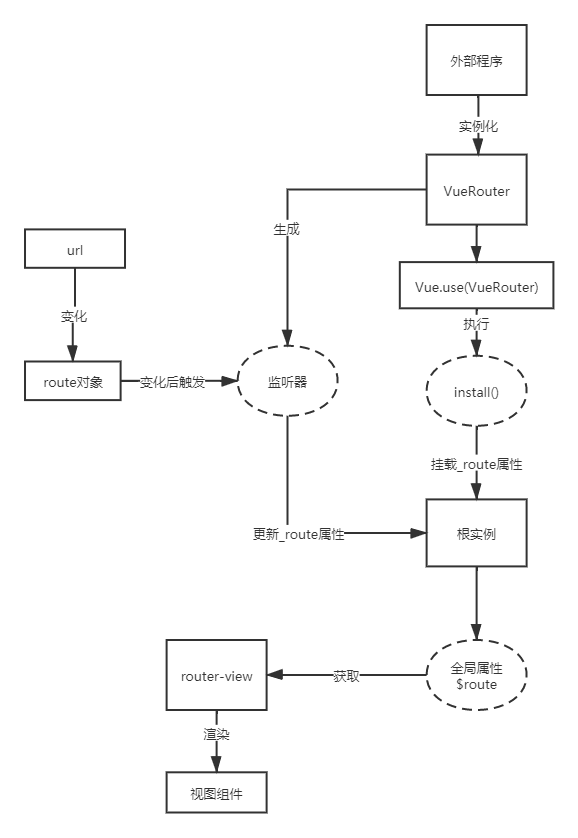

## 7.router-view的实现

`router-view`是`vue-router`中非常重要的组件之一，它用来渲染路由所对应的视图组件。当路由进行切换时，匹配到的视图组件最终会在这里被渲染出来，下面来了解它是如何实现的，源码位置位于`components/view.js`中。

### 函数式组件

首先看第一部分的源码：
```JavaScript
export default {
  name: 'RouterView',
  functional: true,
  props: {
    name: {
      type: String,
      default: 'default'
    }
  },
  ...
}
```
这部分是对组件的定义，该组件只支持传一个参数`name`，`functional: true`表示该组件是个**函数式组件**。

什么是函数式组件呢？简单点来说，它和真正的组件实例相比起来，结构更加的简单，具有以下特点：
1. 没有生命周期、没有计算属性`computed`、没有`watch`等。
2. 没有自己的数据，所有数据都依靠`props`。
3. 不需要实例化，没有`this`(可以指定)。
4. 渲染的开销小。

更多函数式组件的内容，可以到Vue的官方文档进行查阅。

综上来说，因为`router-view`只是一个单纯接收数据显示内容的组件，它不需要有一些其他的操作。所以使用函数式组件是非常合适的，可以提高页面渲染效率。

### render()函数

`render()`函数就是进行组件渲染的核心函数了，下面一起来看看`router-view`是怎么渲染内容的。

```JavaScript
render (_, { props, children, parent, data }) {
    // used by devtools to display a router-view badge
    data.routerView = true

    const h = parent.$createElement
    const name = props.name
    const route = parent.$route
    const cache = parent._routerViewCache || (parent._routerViewCache = {})
    ...
}
```
首先它会给每一个`router-view`打上一个标记，第一个是为官方调试器`vue-devtools`的调试提供方便，第二是在后面处理嵌套路由的时候会用到。

然后紧接着从父组件获取到了渲染函数`createElement`，当前的路由实例`$route`等属性还有从传入的`name`参数。

#### 获取视图组件

要先渲染视图，首先就是要获取视图组件。前面的章节说过了，每一个路由都会有一个指定的`record`对象，视图组件就存放在其中。而该路由的`record`和上级路由的`record`都会存放在一个属性名为`matched`的数组中，分别由上而下按顺序放置。因此，就要从`matched`数组中拿到对应的`record`，然后才能获取到视图组件。

但是怎么才能准确的定位到是`matched`数组中的哪个`record`呢？上面讲到，`matched`数组的顺序是由上而下的。根据这个关系，就可以获取到当前路由的`record`对象。来看一下源码是如何解决这个问题的：
```JavaScript
let depth = 0
let inactive = false
while (parent && parent._routerRoot !== parent) {
      const vnodeData = parent.$vnode ? parent.$vnode.data : {}
      if (vnodeData.routerView) {
        depth++
      }
      if (vnodeData.keepAlive && parent._directInactive && parent._inactive) {
        inactive = true
      }
      parent = parent.$parent
}
```

首先定义了`depth`这个变量，用来统计`router-view`组件嵌套的深度。然后会从当前组件开始向上搜寻，如果上级组件中带有`routerView`标识，则表示存在父级路由，`depth`加1，一直到根组件。最后的`depth`在`matched`数组中对应的位置，就是相应的`record`对象。

`inactive`变量主要是处理`router-view`组件被`keep-alive`组件包裹的情况，如果`inactive`为`true`就会去执行`keep-alive`组件相关的逻辑。

算出`depth`之后，就可以拿到对应的视图组件了
```JavaScript
    const matched = route.matched[depth]
    const component = matched && matched.components[name]
    
    if (!matched || !component) {
      cache[name] = null
      return h()
    }
```
如果找不到的话，那就不给`h()`函数传参，渲染一个空节点。

#### 注册组件实例

在讲`install()`函数的时候，说到在`beforeCreate()`钩子和`destroyed()`钩子中，执行了一个名为`registerInstance()`的函数，先贴上源码：
```JavaScript
const registerInstance = (vm, callVal) => {
    let i = vm.$options._parentVnode
    if (isDef(i) && isDef(i = i.data) && isDef(i = i.registerRouteInstance)) {
      i(vm, callVal)
    }
  }
```
这段代码主要是为了找出所有包含`registerRouteInstance()`方法的`vnode`，然后执行`registerRouteInstance()`方法。而`router-view`组件内部刚好具有这个方法。

```JavaScript
data.registerRouteInstance = (vm, val) => {
      // val could be undefined for unregistration
      const current = matched.instances[name]
      if (
        (val && current !== vm) ||
        (!val && current === vm)
      ) {
        matched.instances[name] = val
   }
 }
```
这个方法的内容也很直观，就是把相应的`val`值放在`record`对象的`instance`属性上。

综合两段代码，就可以明白`registerRouteInstance()`方法的含义——就是给`route`对象注册当前的`Vue`实例。

所以可以看到`beforeCreate()`中是这么使用的
```JavaScript
registerInstance(this,this)
```

而`destroyed()`需要卸载实例，所以可以这么使用
```JavaScript
registerInstance(this)
```
不传第二个参数，那么`instance`就会赋值`undefined`，就完成了卸载。

最后就是通过`h()`函数，渲染出获取到的视图组件

```JavaScript
return h(component, data, children)
```

### 如何触发router-view的更新
我们都知道，当路由变化的时候，`router-view`渲染的内容也会跟着路由的变化而变化。那这个过程到底是怎么样的呢？接下来就给大家介绍一下从`route`变化到`router-view`更新的过程：

首先已经知道了，需要渲染的视图组件在`route`对象的`matched`属性中，而`route`对象的来源，是来自`router-view`组件外层实例的`$route`属性。
```JavaScript
const route = parent.$route
```
而`$route`属性在讲解`install.js`的时候有讲
```JavaScript
Object.defineProperty(Vue.prototype, '$route', {
    get () { return this._routerRoot._route }
 })
```
`$route`属性其实访问的就是`this._routerRoot._route`。而这个属性又在`mixin`函数中。

```JavaScript
Vue.util.defineReactive(this, '_route', this._router.history.current)
```
这里使用了`Vue`的`defineReactive`函数，把`this._routerRoot._route`变成一个响应式的数据。也就是说，`router-view`使用了`$route`，实际上也就是使用了`this._routerRoot._route`，所以`router-view`实际上是`this._routerRoot._route`的依赖，一旦`this._routerRoot._route`发生更新，就会通知`router-view`进行更新。

那接下来就是要找出，`this._routerRoot._route`属性是在哪里被更新的。

在创建`VueRouter`实例的时候，有以下方法：
```JavaScript
history.listen(route => {
    this.apps.forEach(app => {
    app._route = route
  })
})
```
这里运用了`history`对象的`listen`方法，传入了一个函数，内容就是更新`_route`属性。

这个时候再回调`history/base.js`中，看到`listen`方法的定义
```javascript
listen (cb: Function) {
    this.cb = cb
  }
```
其实就是把传入的函数保存起来了。

在`transitionTo()`方法中，又存在以下代码
```JavaScript
this.updateRoute(route);
```
这个`updateRoute`方法其实就是更新一下路由，并且执行回调函数，将获取的新`route`对象传入
```JavaScript
updateRoute (route: Route) {
    this.current = route
    this.cb && this.cb(route)
  }
```

至此 从获取route对象到router-view的更新就完成了，这里做个总结：
1. 在实例化`VueRouter`的时候，添加了一个监听器，内容是更新根实例上的`_route`属性。
2. 当执行`install`方法的时候，会给根实例挂载一个`_route`属性，该属性为响应式数据。并将该属性包装`Vue`的全局属性`$route`暴露给外界访问。
3. `router-view`组件利用`$route`属性进行视图组件的渲染，会被`_route`属性的依赖收集器所收集。
4. 当进行跳转的时候，会执行监听器的函数，并将新的`route`对象作为参数传入，更新根实例上的`_route`属性。
5. `_route`属性发生更新，就会通知`router-view`组件去更新数据，从而渲染新的视图组件。

下一面用一张图来概括这个流程：



### 小结
- 因为`router-view`并不需要有自己的处理逻辑，它只是一个接收`props`并渲染内容的组件。所以比起使用真正的组件实例，函数式组件才是更好的选择，可以降低渲染开销，提升页面渲染速度。
- 在matched数组中，存放`record`对象的顺序和`route`对象的层级有关，因此可以通过寻找上级的`router-view`组件来确定深度，也就确定了所需的`record`对象在`matched`数组中的位置。
- `router-view`内部有一个`registerRouteInstance`方法，主要是给`route`对象注册当前的实例。
- `router-view`使用根实例的`_route`属性进行视图组件的渲染，而该属性又是一个响应式数据，所以当发生页面跳转时，`_route`发生改变，从而触发`router-view`的更新。

