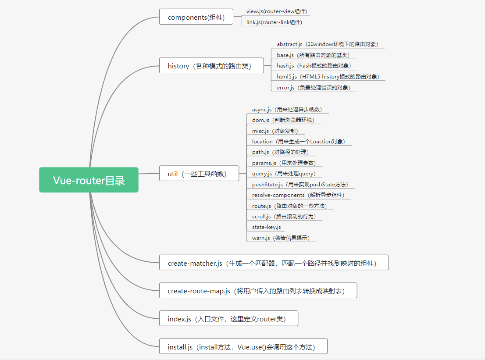

## 阅读前的准备

  vue-router大家已经是很熟悉了，它是官方提供的一个路由导航插件，用来弥补Vue本身对路由的支持不足。用户可以传入一张配置表，将路径和组件实例映射起来，当访问指定路径的时候，就会将相应的组件渲染到页面上。vue-router能够帮助实现一个单页面应用(SPA)。本次是对vue-router源码的解读，如果哪里说的不对，还请大家帮忙指正一下。

### 需要准备的知识点

1. Vue插件的编写

- 插件是Vue为提供的一个拓展功能，就是指对Vue的功能的增强或补充。当编写完一个插件时，通过Vue.use()方法，将这个插件注册到全局或者是某个Vue实例上，像vue-router、vuex都是一些Vue插件。
- 在插件中可以实现对Vue的拓展，比如新增全局属性/方法、添加实例方法、使用mixin混入其他配置项等等。
- 编写插件的话，必须要实现install方法，当调用Vue.use()使用插件时，会去执行插件中的install()方法。该方法默认会有两个参数，第一个是Vue的实例，第二个是配置选项options。

2. hash和history

- 这两种模式都是浏览器提供的特性，都可以改变当前路径并且不会导致浏览器刷新页面，也是vue-router实现的核心。
- hash就是指url中后面的#号以及后面的字符，这里的 # 和 css 里的 # 是一个意思。hash 也称作锚点，本身是用来做页面定位的，可以使用hashchange事件进行监听。当浏览器向指定服务器发送请求时，是不会将hash值带上的，所以hash值的变化并不会导致浏览器刷新页面，因此可以拿来实现前端路由。但是因为hash是拼接在url上，而url的长度又有限制，所以hash并不能传递大量数据。
- history会以栈的形式保存着用户所访问过的url，在HTML5中，为history新增了两个API分别是history.pushState() 和 history.replaceState()，用来在浏览历史中添加和修改记录。使用popstate事件对浏览器前进后退进行监听，再利用history.pushState() 和 history.replaceState()修改历史历史记录，也可以实现路由的效果，并且这两个API支持传入需要保存的数据，在触发popstate事件时，可以在event.state里获取，数据的类型和大小也无限制。

### 本次源码剖析的内容
在本次源码剖析中，会了解到以下内容的实现：
1. $router、$route是怎么来的
2. hash模式、history模式的实现
3. 钩子函数的实现
4. router-view、router-link组件的实现
5. 从路由变化到对应组件渲染的完整过程

### 如何调试
去GitHub下载官方的源码，官方有很多例子，下载完之后，执行以下两行npm命令:
```
npm i
npm run dev
```

### 源码的文件目录

vue-router源码的目录结构以及作用大概如下图：




