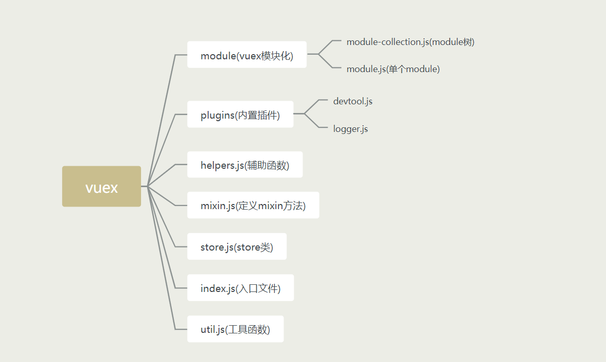

## 阅读前的准备

vuex是vue官方提供的一个状态管理工具，开发者可以利用vuex，将vue项目中的一些状态进行集中式地管理。贴上vue官方提供的一张vuex的关系图，了解一下vuex中各部分之间的关系：


在接下来的vuex源码讲解之前，首先得先确保你对vue和vuex的使用有足够的了解。

本次解析会给读者分析以下功能的实现：

1. vuex是如何挂载到vue上的
2 .如何通过Mutaion修改state，如何使用Action提交Mutation
3. state如何实现响应式以及getter的实现
4. vuex模块化实现
5. 插件功能的实现
6. 辅助函数mapState、mapMutations、mapGetters、mapActions的实现


调试的话直接去GitHub下载官方的源码，官方有很多例子，下载完之后，执行以下两行npm命令:

```
npm i
npm run dev
```


接下来介绍一下vuex源码的文件结构：



接下来就开始我们的源码之旅吧！
